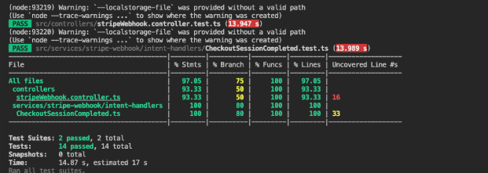
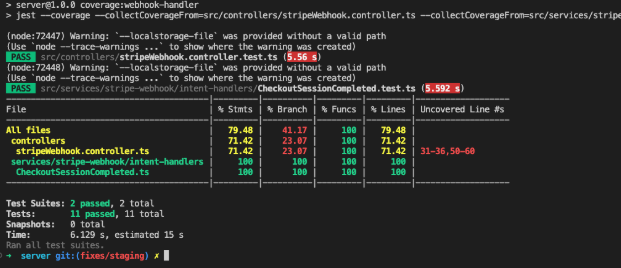
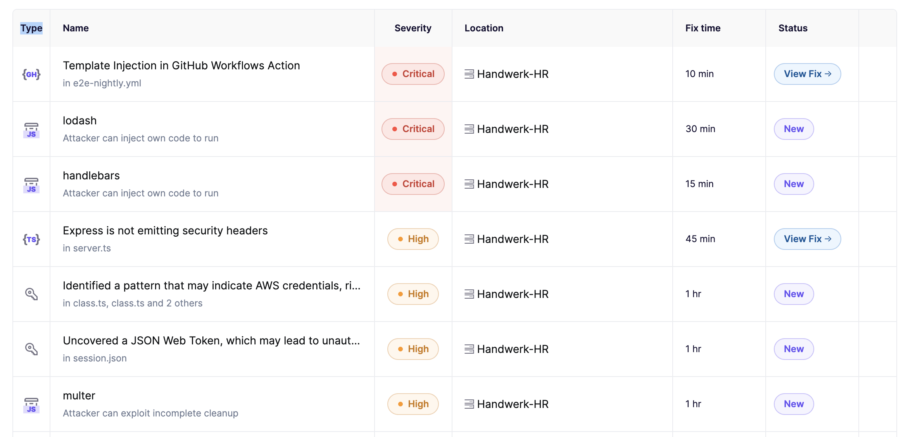

# Tests

Before pushing changes ensure that you have. (This is also listed in the pull request [template](../../.github/pull_request_template.md))

1. Written a test for this new feature
2. Ran the test on this feature
3. Ran the coverage for the respective runner to see if the changes you did, did not worsen the coverage of the codebase

## Understanding fixtures and types used in /server tests

Fixtures and types are based on the objects provideded by stripe and therefore can be confusing. Refer to their documentation to understand how the sent objects look like. This should clear any confusion to why something got done in the code: [stripe_docs](https://docs.stripe.com/api/checkout/sessions/update)

After making changes run coverage test for the codebase to check that your added changes did not lead to a worse coverage. If yes ensure that you refactor so that the coverage is kept where it should be.

## Running tests

Run the following commands in the `/client`for testing either unit, integration or end to end

- `npm run test:unit`
- `npm run test:integration`
- `npm run test:e2e`

Run the following commands in the `/server`for testing all tests

- `npm test`

## Setting up test coverage

Test coverage is being tested with jest and vite. (playwright is currently not included)

// Note: Test coverage test what files are being covered by your tests. It does not imply that all lines are being tested for

`/Client` (vitest & playwright)

- In the `/client` directoy and run `npm run test:coverage` (Note this includes coverage only for vitest imported files)
- In the `/client`directory run `npm run test:coverage:full` to include files not imported into the test files

`/Server` (server)

-In the `/server` directoy and run `npm run coverage:webhook-handler` to get the coverage results for `stripeWebhook.controller.ts` and `CheckoutSessionCompleted`
-For the overall test coverage run `npm test -- --coverage`
-To get the test coverage for the entire server directory including files not imported by jest run `npm test -- --coverage --collectCoverageFrom='src/**/*.ts' --collectCoverageFrom='!src/**/*.d.ts'`

## Example test coverage

Below is an example of a test coverage result before implementing a refactor and after implementing a refactor. The refactor could only be safely made due to extensive testing before ensuring that the refactor did not change the functionality of the refactored code.

## Before

## After

## Code analysis tools:

This project uses Aikido Security [docs](https://help.aikido.dev/)

Aikido is a tool that analyzes the entire codebase for security vulnerabilities. After having pinpointed the issues it gives a severity level and also solutions on how to fix the problem. Use aikido security to ensure that any changes you made do not cause security vulnerbilitues for the codebase.

Below is a screenshot of the aikido manager showing the analysis of my codebase:

